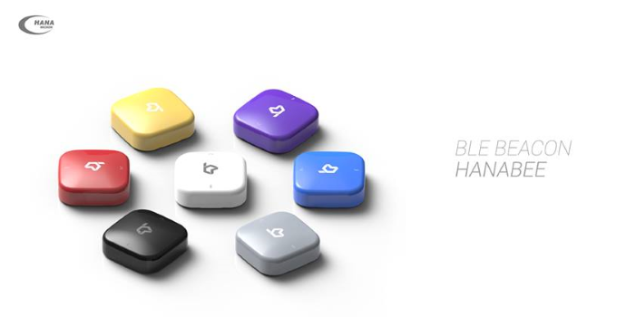

HanaBEE_Android_SDK
===================

**hana**bee
------------
**Bluetooth Low Energy (BLE) Beacon SDK** 

*IoT Biz Team*

### hanabee SDK 는:

- 간편하게 bluetooth le scan을 구현하실 수 있습니다.
- 곧바로 동작 가능한 샘플소스가 포함되어 있습니다.
- 스캔, 거리에 따른 이벤트 발생 기능을 제공합니다.
- 삼각측위를 통한 위치계산 기능은 trial 버전으로 제공합니다. https://github.com/HanaBEE/HanaBEE_Android_Indoor_SDK_trial 에서 다운로드 받으실 수 있습니다.

### hanabee 는:

블루투스 4.0, Low Energy (BLE) 를 이용한 비콘시스템으로, 아래와 같은 특징을 가지고 있습니다.

-	보안강화(Anti-Spoofing): 128 bit 암호화
-	배터리 관리(Battery Management): 추가 접속 없이 배터리 정보확인. 
-	근접감지(Proximity Sensing): 가능
-	삼각 측위를 통한 위치계산(Trilateration): 가능
-	배터리 타입: 
    #### hanabee Slim
    AA 건전지 2개 (2800 mAh, 교체 가능)

    #### hanabee Mini
    CR2450 코인 배터리 1개 (800 mAh, 교체 가능) 또는 USB 전원

### SDK 최소사양:

- Android 4.3 또는 이후 버전 OS (Bluetooth le 지원)
- BLE를 지원하는 Android device(일부 기기는 OS가 Android 4.3 이상이지만 하드웨어에서 지원하지 못하는 경우가 있을 수 있습니다

hanabee 비콘에 대한 설명은 아래 사이트에서 확인하실 수 있습니다.
[www.hanabee.io]:http://www.hanabee.io

HANA Micron. Inc.
B-903, Pangyo siliconpark, 613
Sampyeong-dong, Bundang-gu, Seongnam-si
Gyeonggi-do, South Korea
+82) 31 698 9022
hanabee@hanamicron.co.kr

This document is available at: https://github.com/HanaBEE/HanaBEE_Android_SDK 

License
--------
  Copyright 2015 HANA Micron. Inc. 
  
  **All rights reserved.**